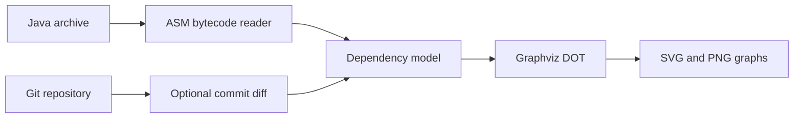

# Dependency Viewer

Dependency Viewer is a small Java CLI that inspects compiled classes in a JAR, WAR, or ZIP archive and produces a dependency graph. It uses ASM to read bytecode, can limit the graph to classes changed between two Git commits, and renders the result with Graphviz.

## Features

- detects dependencies created by fields, method parameters, object creation, and method calls;
- optionally filters the result using a Git diff;
- supports wildcard-based ignore rules;
- writes the intermediate `graph.dot` file and renders `graph.svg` and `graph.png`;
- runs on Java 17 or newer.

## How it works



## Requirements

- Java 17+

Maven and Graphviz do not need to be installed: the repository includes Maven Wrapper and an embedded Graphviz-compatible rendering engine for 64-bit Windows, Linux, and Intel macOS. On other architectures the application falls back to an installed `dot` command.

## Build

On macOS or Linux:

```shell
bash mvnw clean package
```

On Windows:

```powershell
.\mvnw.cmd clean package
```

The runnable archive is created at `target/dependency-viewer-1.0.0-SNAPSHOT.jar`.

## Usage

```shell
java -jar target/dependency-viewer-1.0.0-SNAPSHOT.jar [options] <repository> [archive]
```

Examples:

```shell
# Search the repository for an archive and analyze it
java -jar target/dependency-viewer-1.0.0-SNAPSHOT.jar /path/to/project

# Analyze a specific archive
java -jar target/dependency-viewer-1.0.0-SNAPSHOT.jar /path/to/project /path/to/app.jar

# Select a branch and two commits interactively, then include only changed classes
java -jar target/dependency-viewer-1.0.0-SNAPSHOT.jar --git-diff /path/to/project /path/to/app.jar

# Apply ignore rules and shorten long class names
java -jar target/dependency-viewer-1.0.0-SNAPSHOT.jar \
  --ignore dependency_class.ignore --simplify-names /path/to/project /path/to/app.jar
```

Run with `--help` to see all options. If the repository argument is omitted, the program asks for it interactively.

### Ignore file

The ignore file contains one class-name pattern per line. Empty lines and lines beginning with `#` are skipped. `*` matches any number of characters.

```text
# JDK classes
java.*
javax.*

# Generated code
*.generated.*
```

## Graph legend

Each edge label contains four counts in this order:

```text
new;invoke;field;method-parameter
```

Green represents object creation, red a method call, blue a field type, and black a method parameter.

## Current limitations

- The analyzer focuses on direct bytecode references. It does not currently include inheritance, annotations, generic signatures, or method return types.
- Git filtering maps compiled classes back to Java source paths. Classes generated from other JVM languages may not map correctly.
- Commit and branch selection is interactive.
- Large archives can produce graphs that are difficult to read; ignore rules are recommended.

## Development

Run all tests with:

```shell
bash mvnw verify
```

The project deliberately stays framework-free. Core behavior is split between archive reading, bytecode analysis, Git integration, and Graphviz mapping.
